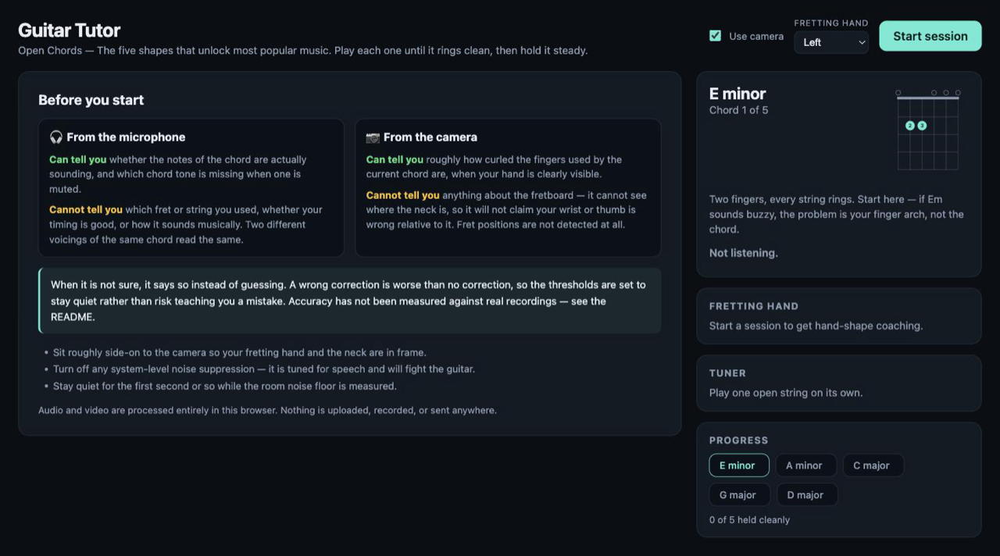
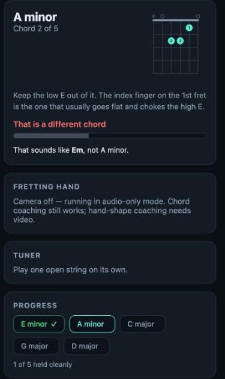
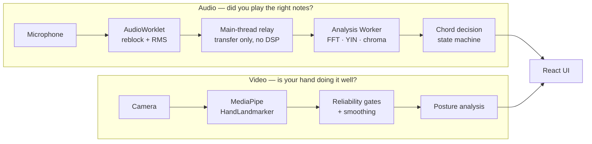

# AI Guitar Tutor

A privacy-first browser coach that listens to guitar chords, watches fretting-hand posture, and refuses to guess when the evidence is unreliable.




[](https://github.com/kushvijapure/ai-guitar-tutor/actions/workflows/ci.yml)

> **Beta.** The decision logic is unit-tested and the pipeline has been exercised
> in a browser against *synthetic* audio. It has **not** been validated with a real
> guitar, a real microphone, or a real camera, and no accuracy figure is claimed
> anywhere in this repository. See [Validation status](#validation-status).

## Run locally

```bash
npm install
npm run dev      # http://localhost:5173
```

Grant microphone permission when prompted; the camera is optional. Turn off any
OS-level audio "noise suppression" — those filters are tuned for speech and fight
a guitar. Stay quiet for the first second or so while the room noise floor is
measured.

**There is no hosted demo.** This project is not deployed anywhere, so the only
way to run it is locally.

| Command | What it does |
| --- | --- |
| `npm run dev` | Dev server. Stages MediaPipe assets first. |
| `npm test` | 329 unit tests across DSP, pitch, chords, decisions, posture and the audio transport. |
| `npm run measure` | Prints every decision gate across 27 scenarios. Use when changing a threshold. |
| `npm run verify` | End-to-end DSP smoke check. |
| `npm run bench` | Analysis cost and real-time factor. |
| `npm run ci` | typecheck → lint → test → verify → build, in the order CI runs them. |

## What it does

**Hears whether you played the right notes.** A 12-bin chroma is matched against
chord templates, then put through gates that similarity alone cannot answer —
distinct pitch-class count, characteristic-tone presence, top-match margin, and
agreement across four consecutive analysis windows.

**Watches the fingers the chord actually uses.** MediaPipe's 21 hand landmarks
become per-finger joint angles. Fingers the current chord does not fret are not
judged, and any finger the geometry cannot measure reliably is reported as
unmeasurable rather than guessed at.

**Says "I can't tell" out loud.** *Can't tell yet*, *Unable to assess reliably*
and *That is a different chord* are first-class outcomes, not placeholders.

**Never sends your audio or video anywhere.** No backend, no telemetry, no
uploads. Everything runs in the browser tab.

## The design principle

**An incorrect correction is worse than no correction.** A player told their
finger is flat when it isn't will "fix" something that was already right, and
they have no way to know the coach was wrong.

So every judgement is gated, and when a gate fails the app reports that it cannot
tell instead of guessing. This has a real cost: the app stays quiet in situations
where a more confident tool would say something, and some genuinely correct
playing will not be confirmed. That trade is deliberate.

It is also why capabilities were *removed* rather than approximated. The app
cannot see the fretboard, so it no longer claims your wrist is wrong relative to
a neck it cannot locate — wrist and thumb notes are now tentative observations,
phrased conditionally and never counted as errors.

<p align="center">
  
</p>
<p align="center">
  <em>The coach naming what it actually heard instead of failing silently.<br>
  Captured with <strong>simulated audio input</strong> — a synthesised open Em, not a real guitar.</em>
</p>

## Architecture



The audio thread only reblocks and measures level. All DSP happens in the Worker,
where the decision state machine also runs at the full analysis rate — so
throttling the UI to 12 Hz changes only how often numbers move on screen. It
cannot weaken a correctness gate.

## Validation status

**The automated logic and simulated browser lifecycle pass; real-player coaching
accuracy remains unvalidated.**

| | Status |
| --- | --- |
| 329 unit tests, 9 files | Passing |
| DSP verification, gate measurement, typecheck, lint, build | Passing |
| Browser lifecycle (worklet → worker → UI, start/stop) | Passing — **with stubbed `getUserMedia` over synthetic audio** |
| Real guitar, real microphone | **Not done** |
| Real camera, real hands, handedness | **Not done** |
| Permission dialogs and denial paths | **Not done** |

Every browser observation recorded in this project so far used a stubbed
`getUserMedia` over a synthetic source. No real microphone, camera, or guitar has
been used at any point. Synthetic signals have no inharmonicity, no fret buzz, no
body resonance, no room, and a noise profile no real microphone produces — so the
tests demonstrate that the logic behaves as designed, not that the coaching is
correct for a real player.

One recognition gap is known and unresolved: a C major with an added F scores
**0.901** against the C template, while a legitimately bright C scores **0.896**.
The wrong chord scores *higher* than the right one, so **no threshold on that
score can separate them**. Details in
[docs/audio-recognition.md](docs/audio-recognition.md#the-added-note-gap).

## License

[MIT](LICENSE).

## Documentation

| Document | Contents |
| --- | --- |
| [Architecture](docs/architecture.md) | Threading model, module map, measured performance |
| [Audio recognition](docs/audio-recognition.md) | Chroma, the five gates, measured scores, the added-note gap |
| [Hand tracking](docs/hand-tracking.md) | Landmark geometry, reliability gating, what was removed |
| [Validation](docs/validation.md) | What has been tested, how, and what a real evaluation requires |
| [Known limitations](docs/known-limitations.md) | Limits, release blockers, third-party asset story |

## Stack

React 19 + TypeScript (strict) + Vite, MediaPipe Tasks Vision (hand landmarker),
Web Audio API with a custom FFT. No backend, no telemetry, no data leaves the
browser.
