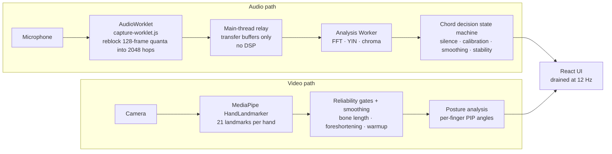

# Architecture

[← back to README](../README.md)

Two independent questions, answered by two independent sensors, joined only at
the UI. Either can fail without taking the other down: if the camera fails the
session continues in audio-only mode, because chord coaching is the part that
actually judges correctness.

## Pipeline



## Threading

| Thread | Runs | Deliberately does not run |
| --- | --- | --- |
| Audio thread | `capture-worklet.js` — reblocking and RMS only | Anything that could overrun the render deadline |
| Main thread | Transfers buffers onward | **No DSP** |
| Worker | FFT, YIN, chord decision state machine | — |
| Main thread | Drains the newest result into React at 12 Hz | — |

The decision state machine lives in the Worker and advances at the full analysis
rate. Throttling the UI changes only how often numbers move on screen; it cannot
weaken a correctness gate.

### Backpressure

`postMessage` queues without bound. If the Worker falls behind — a GC pause, a
throttled background tab, a slow machine — hops accumulate at 8 KB and ~46 ms of
latency each, and the coach ends up commenting on audio from several seconds ago
while memory climbs. The main thread therefore drops the newest hop once
`MAX_INFLIGHT_HOPS` (6) are outstanding, bounding latency to roughly 280 ms.

Dropping is safe because the Worker treats a gap in the sequence as a
discontinuity and refills its whole window before analysing again, so no decision
is ever computed from spliced audio. Normal operation sits at 0–1 outstanding.

## Analysis parameters

Values read from `src/lib/thresholds.ts` at commit `bf2f3b2`.

| Constant | Value | Consequence |
| --- | --- | --- |
| `FRAME_SIZE` | 8192 | Analysis window |
| `HOP_SIZE` | 2048 | 42.7 ms at 48 kHz, 46.4 ms at 44.1 kHz |
| `STABILITY_WINDOWS` | 4 | ~171 ms at 48 kHz / ~186 ms at 44.1 kHz of agreement before a chord is confirmed |
| `PITCH_DECIMATION` | 4 | YIN runs at ~11 kHz (Nyquist 5.5 kHz) |
| `MAX_INFLIGHT_HOPS` | 6 | Latency ceiling under overload |
| `UI_UPDATE_HZ` | 12 | React update rate only |

Guitar fundamentals top out around 1.2 kHz, so quarter-rate decimation for pitch
detection discards nothing the app uses. YIN is `O(window × maxLag)` and is the
single most expensive step in the pipeline, which is what makes that decimation
worth doing.

## Measured performance

Two different measurements exist, and they must not be confused for each other.

### Node microbenchmark — `npm run bench`

Pure arithmetic, no browser, no audio hardware. Frame 8192, hop 2048, 400
iterations, node v24.18.0 on darwin/arm64 (Apple silicon):

| Scenario | Rate | Mean | p95 | Max | Real-time factor |
| --- | --- | --- | --- | --- | --- |
| Chord, full analysis | 44 100 | 0.628 ms | 0.709 ms | 1.129 ms | 74.0× |
| Chord, full analysis | 48 000 | 0.666 ms | 0.743 ms | 0.965 ms | 64.1× |
| Silence, early exit | 44 100 | 0.008 ms | 0.009 ms | 0.014 ms | 5542× |
| Silence, early exit | 48 000 | 0.008 ms | 0.009 ms | 0.025 ms | 4990× |

The early exit on silent windows is why idle CPU between strums is near zero.

### In-browser — Chrome, 48 kHz

**Measured under automated Chrome driving a synthetic audio source, not a real
microphone:**

| Metric | Value |
| --- | --- |
| Mean cost per analysis | 4.43 ms |
| Worst observed | 45 ms — the first frame, while cold |
| Hop budget at 48 kHz | 42.7 ms |

The browser figure is roughly **7× the node microbenchmark**, and the cold first
frame came in one millisecond *over* the hop budget before settling. Comfortable
in steady state, but the headroom is nothing like the 64× the node number
suggests in isolation. Re-measure on target hardware rather than trusting either
figure.

> An earlier revision of this project described the analysis as costing about
> 1 ms in the browser. That was wrong — it was a synthetic-load figure quoted as
> if it characterised real browser behaviour. The corrected numbers are above.

A prototype-era table comparing pitch-detection cost at 1×, 2× and 4×
decimation used to appear in the README. The current `npm run bench` does not
produce those figures and they are not reproducible from this tree, so they have
been dropped rather than restated.

Press **Show diagnostics** during a session for live analysis cost and
processed/skipped frame counts on your own machine.

## Module map

```
src/
  lib/
    thresholds.ts       every tunable, with the reasoning for its value
    dsp.ts              FFT, Hann window, anti-aliased decimation, level metering
    pitch.ts            YIN pitch detection (tuner, single notes)
    chroma.ts           chroma extraction, chord templates, the decision gates
    chordDecision.ts    state machine: silence, smoothing, stability, calibration
    analyzer.ts         one window in, one observation out (pure, preallocated)
    posture.ts          hand-landmark geometry -> coaching cues, with gating
    notes.ts            note naming, cents, standard-tuning reference
    mediaErrors.ts      getUserMedia failures -> actionable messages
    mediapipeAssets.ts  pinned runtime/model versions
  audio/
    capture-worklet.js  AudioWorklet: reblocks audio-thread quanta into hops
    analysis.worker.ts  Worker: FFT, pitch, chord decision
    messages.ts         the contract between them
  hooks/
    useAudio.ts         mic -> worklet -> worker -> throttled React state
    useHandTracking.ts  MediaPipe, rate-capped and smoothed
  components/           CameraView, ChordDiagram, ChordStatusPanel,
                        FeedbackPanel, SessionIntro, Diagnostics
  lessons/
    openChords.ts       chord shapes + lesson definition
tests/
  signals.ts            synthetic guitar signal generators
  hands.ts              synthetic hand landmark sets
  *.test.ts             the suites
scripts/
  verify-dsp.ts         end-to-end smoke check
  measure-gates.ts      threshold headroom diagnostic
  bench.ts              performance benchmark
  fetch-assets.mjs      stages MediaPipe assets into public/
```

## Why not detect frets from the camera?

Because it does not work well enough to teach with. Fret spacing above the 7th
fret is a few millimetres at webcam resolution, and the fretting hand occludes
the exact region you would need to see. A wrong *"you're on the 3rd fret"* is
worse than no claim at all. Audio sidesteps the problem: it knows what was played
regardless of where the camera is.
